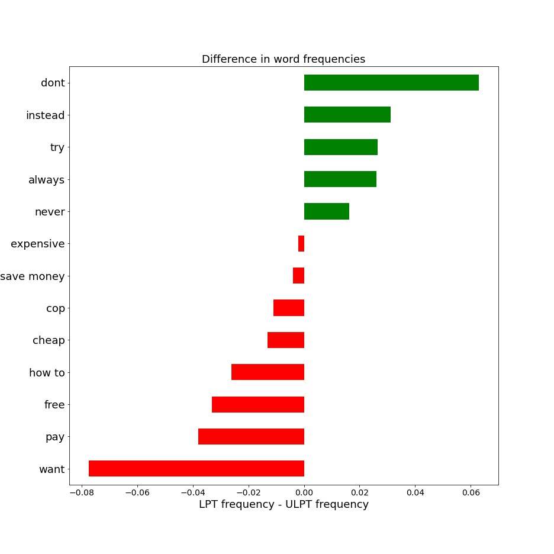
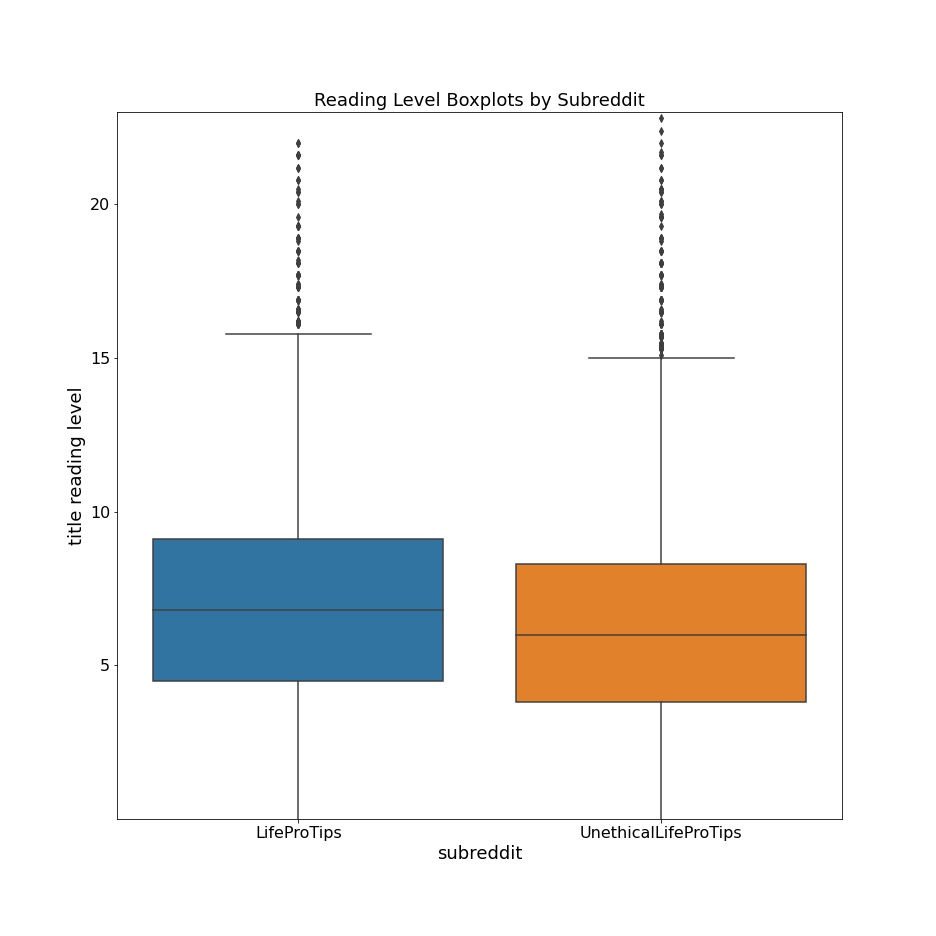
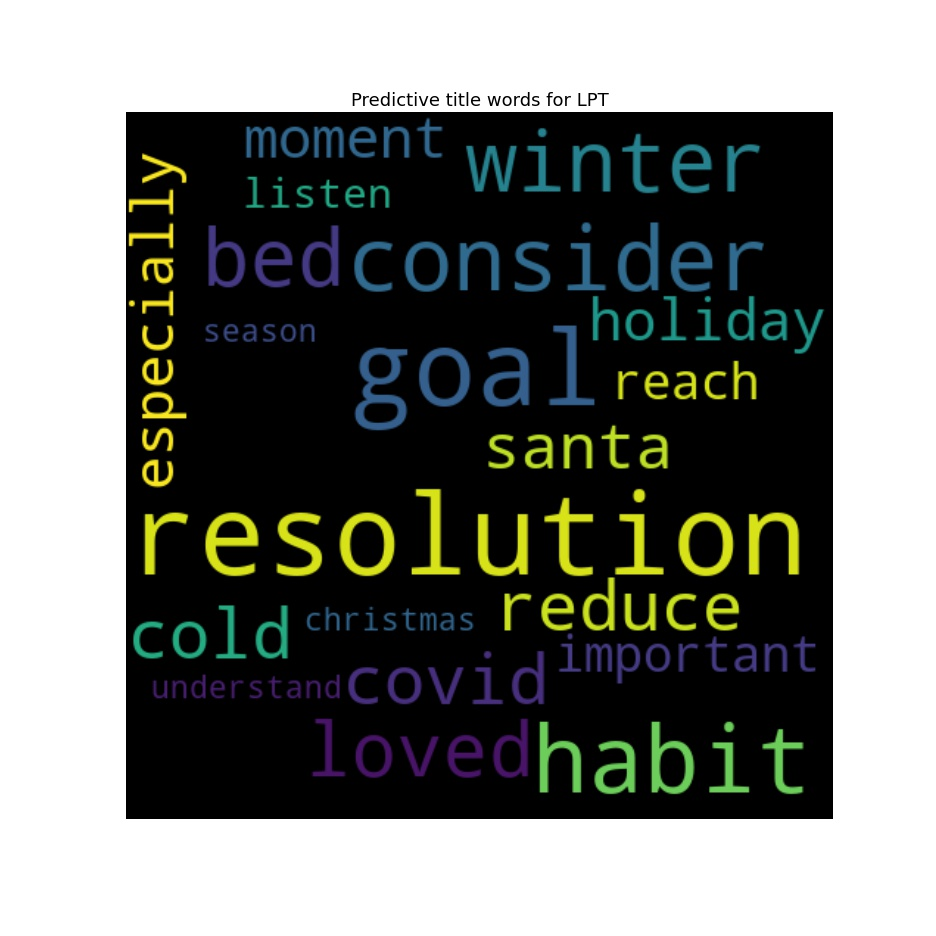
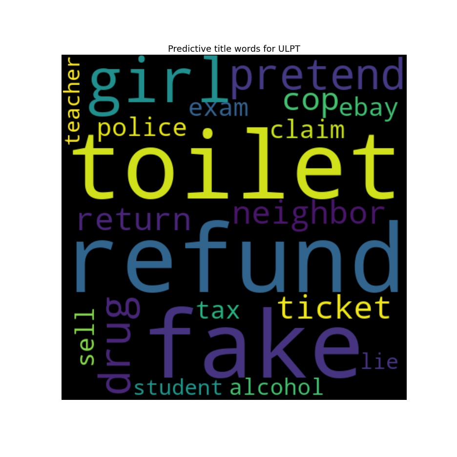

# Is Your Advice Unethical?
Scott Atkinson

## [0. Contents](#0.)

## [1. Introduction](#1.)

## [2. EDA](#2.)
* ### [2.0. Word frequency](#2.0.)
* ### [2.1. Reading level](#2.1.)
* ### [2.2. Custering topics](#2.2.)

## [3. Preprocessing]
* ### [3.0. Most predictive words](#3.0.)

## [4. Modeling](#4.)
* ### [4.0. Web app](#4.0.)

## [5. Blog post](#5.)

## 1. Introduction

Ethics is an important facet of civilization, and a community's ability to discern between ethical and unethical behavior is critical for a healthy society. In any business, school, or community, ethical communication and behavior is of high importance. For many situations, it is not difficult to decide if an action is ethical or not, but there are also many scenarios lying in an ethical gray area. The growing scale of text communication makes moderating social media sites, internal business communication platforms, and other online forums impossible to do manually - calling for an automated approach to detect unethical behavior.

This project applies machine learning techniques to statistically detect unethical advice and address the question "What makes a piece of advice unethical?"
We will use data from two subreddits on the [Reddit](https://www.reddit.com) website: [LifeProTips](https://www.reddit.com/r/LifeProTips) and [UnethicalLifeProTips](https://www.reddit.com/r/UnethicalLifeProTips). For most of the posts in these subreddits, a typical well-adjusted adult human will be able to accurately classify them into their proper subreddits. That is, there are not that many "ethically gray" posts in our dataset. So it is a reasonable expectation that a binary classification model can be trained to flag unethical advice.

Our analysis shows some general trends in the nature of the posts coming from the two subreddits. Advice coming from LifeProTips is generally aimed toward self-improvement. That is, most of the tips involve actions an individual can take to improve the quality of their life. These actions typically do not depend on the cooperation or participation of any other individual. According to the subreddit's description, "A Life Pro Tip (or an LPT) is a specific action with definitive results that improves life for you and those around you in a specific and significant way." 

On the other hand, the pieces of advice coming from UnethicalLifeProTips generally involve some sort of dishonest behavior an individual can adopt with the goal of gaining some sort of advantage (financial, social, emotional, or otherwise) from someone else, often at their (the other's) expense. According to the subreddit's description, "An Unethical Life Pro Tip (or ULPT) is a tip that improves your life in a meaningful way, perhaps at the expense of others and/or with questionable legality." 

We begin by analyzing the data collected from these two subreddits. In particular, we examine some expected word frequencies, compare reading levels across the subreddits, and cluster the posts to find some common topics using latent Dirichlet allocation. We also examine the most predictive words for each subreddit with a multinomial naive Bayes analysis. Next we train a predictive classification model using the data from the two subreddits. We assess and select our classification model and the proper threshold for the intended use of our model. We close by drawing some conclusions from our findings and discuss potential improvements for the model.

The Python code for this project can be found in [this notebook](https://github.com/scatkinson/is_your_advice_unethical/blob/main/EthicalTips.ipynb). This project also has an accompanying [blog post]() with many examples of quotes from the dataset. An interactive version of the obtained classification model has been made available at this [link].

## 2. EDA
The data for this project are obtained from two subreddits on the online forum site [www.reddit.com](https://www.reddit.com): [LifeProTips](https://www.reddit.com/r/LifeProTips) and [UnethicalLifeProTips](https://www.reddit.com/r/UnethicalLifeProTips). The LifeProTips subreddit contains user-generated content in the form of advice, hints, and tips applying across all aspects of life. The UnethicalLifeProTips subreddit contains similar content with the difference being that the tips are unethical, or at best, in an ethical gray area. The data was obtained by scraping the most recent 5000 posts from each subreddit in early January 2021 using the [pushshift](https://pushshift.io/) API. The posts collected run the spectrum from making you laugh to making you cringe.

The data preparation and analysis steps and results can be found in the project's [notebook](https://github.com/scatkinson/is_your_advice_unethical/blob/main/EthicalTips.ipynb).  You can also read the corresponding [blog] for a description of these steps.

### 2.0. Word frequency

After a preliminary look at some entries for each subreddit, we form a list of some words that could be predictive for each and compare their frequencies for each subreddit. The figure below provides a visualization for some of the differences between the word frequencies.

### 2.1. Reading level

We next consider the reading levels of the posts from each subreddit. The following figure displays the box plots for reading level of the (unprocessed) title column by subreddit.

### 2.2. Clustering topics

Next, we apply the unsupervised learning technique of clustering to the titles column of each subreddit. 
 * LifeProTips topics: Resolutions, Cooking/kitchen tips, Money, Gift giving, Mental health, Cleaning, Online behavior
 * UnethicalLifeProTips topics: Avoid ads/paywalls, Scamming return policies/rewards programs, Get out of work, Interpersonal deception/spite/prank, Getting something for nothing, Car-related
See the [blog post] for a more in-depth discussion of this clustering analysis.

## 3. Preprocessing

Consult the [notebook](https://github.com/scatkinson/is_your_advice_unethical/blob/main/EthicalTips.ipynb) to see the preprocessing steps including lemmatization and vectorization.  The [blog post]() also includes some discussion of these steps.

### 3.0. Most predictive words

By fitting a CountVectorizer to the title training data alone, and predicting on an identity matrix, we are able to obtain, for each word in the corpus, the probability that word is predicted to be part of a post from the UnethicalLifeProTips subreddit. The following wordclouds indicate the most predictive words for each subreddit.

See the [blog post] for a more extensive discussion of the most predictive words.

## 4. Modeling

The modeling steps can be found in the [notebook](https://github.com/scatkinson/is_your_advice_unethical/blob/main/EthicalTips.ipynb), and a discussion can be found in the [blog post]. THe use-case of the model as an automated filter for unethical content leads us to prioritize precision. We choose the RandomForestClassifier estimator with threshold 0.5718 to obtain a precision of 89.03% with a recall of 50.20%.

 

 

### 4.0. Web app
A web app where you can input a piece of advice and it will return the model's prediction on whether or not it belongs in the UnethicalLifeProTips subreddit is available at [link]. Have fun seeing what the model gets right and wrong!

## 5. Blog post
As mentioned throughout this document, you can find a write-up of the project in the form of a blog post at [link].
